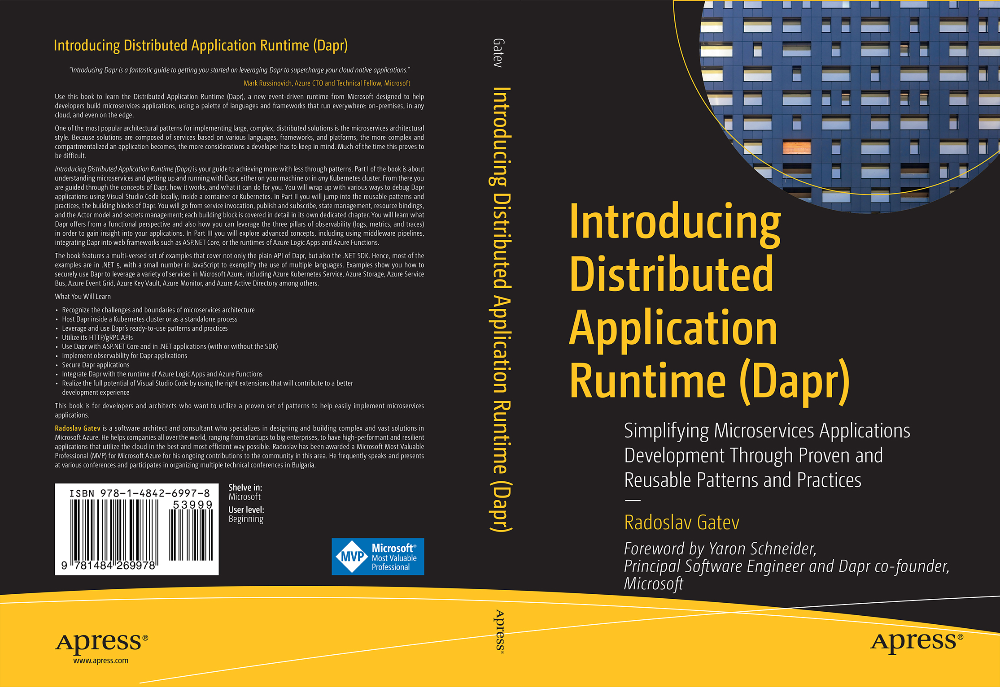

# Apress Source Code

This repository accompanies [*Introducing Distributed Application Runtime (Dapr)*](https://www.apress.com/gp/book/9781484269978) by Radoslav Gatev (Apress, 2021).

Download the files as a zip using the green button, or clone the repository to your machine using Git.

## Releases

Release v1.0 corresponds to the code in the published book, without corrections or updates.

## Corrections

For corrections to the content in the published book, see the file [errata.md](errata.md).

## Contributions

See the file [contributing.md](contributing.md) for more information on how you can contribute to this repository.
